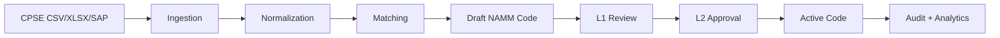

# National AI Material Master

National AI Material Master is a material catalog harmonization platform for the "One Nation, One Material Code" goal across Central Public Sector Enterprises (CPSEs). It ingests material records from CPSE files and SAP-style sources, normalizes descriptions and specifications, detects duplicate or equivalent items, proposes Common National Material Codes, routes approvals through L1/L2 governance, and records durable audit and analytics data.

## Problem Solved

Different CPSE material codes, descriptions, units, and specifications often refer to the same physical item. That fragmentation creates duplicated inventories, weakens consolidated procurement, slows inter-CPSE discovery, and makes national material governance difficult. National AI Material Master provides a durable workflow for mapping CPSE source materials to governed national material records.

## Key Capabilities

- CSV, XLSX, and SAP OData mock ingestion.
- Text normalization and technical attribute extraction.
- Duplicate, near-duplicate, and equivalent-material matching.
- Semantic embeddings with a safe deterministic stub fallback.
- Common National Material Code generation.
- CPSE-to-national material mapping.
- Legacy migration dry-run, import, validation, and rollback.
- L1/L2 approval workflow.
- SHA-256 tamper-evident audit chain.
- Procurement-history analytics.
- Taxonomy governance.
- HTTP Basic Auth with durable users and role-based access control.
- SAP live-mode readiness and configuration boundary.

## System Workflow



## Architecture

- Frontend: React, TypeScript, Vite, React Router, Recharts, and Lucide icons.
- Backend: FastAPI with Pydantic schemas and OpenAPI documentation.
- Persistence: SQLAlchemy ORM and Alembic migrations.
- Local database: SQLite by default at `backend/data/namm.db`.
- Production database target: PostgreSQL through `DATABASE_URL`, with future pgvector deployment support.
- Embeddings: configurable provider interface. The default stub provider is deterministic and safe for local verification; optional sentence-transformer dependencies are isolated from the default install.
- SAP boundary: mock mode is the default; live mode is configuration-ready and keeps credentials out of API responses.
- Audit: append-only SHA-256 hash chain for durable governance events and integrity verification.

## Quick Start

### Backend Setup

From the repository root:

```powershell
python -m venv backend\.venv
.\backend\.venv\Scripts\python.exe -m pip install -r backend\requirements.txt
```

Apply migrations to the configured database. With no `DATABASE_URL`, this creates and updates the local SQLite database at `backend/data/namm.db`.

```powershell
Push-Location backend
.\.venv\Scripts\python.exe .\init_db.py
Pop-Location
```

Start the backend:

```powershell
Push-Location backend
.\.venv\Scripts\python.exe -m uvicorn main:app --host 0.0.0.0 --port 8000 --reload
Pop-Location
```

Backend URLs:

- API: [http://localhost:8000](http://localhost:8000)
- OpenAPI docs: [http://localhost:8000/docs](http://localhost:8000/docs)
- Readiness check: [http://localhost:8000/health/ready](http://localhost:8000/health/ready)

### Frontend Setup

```powershell
Push-Location frontend
pnpm install --frozen-lockfile
pnpm run dev
Pop-Location
```

Frontend URL:

- Web UI: [http://localhost:5173](http://localhost:5173)

### Production Demo Flow

The demo command applies migrations to an explicit SQLite database, seeds local demo roles, runs CSV and SAP mock ingestion, performs matching, creates a national material, completes L1/L2 approval, verifies the audit chain, and prints a sanitized summary.

```powershell
.\backend\.venv\Scripts\python.exe .\backend\run_production_demo.py --database-url "sqlite:///backend/data/production_demo.db" --fresh
```

## Demo Users

Local demo users are created by the demo/bootstrap scripts for the selected local database. They are non-production role accounts for the demo workflow, including administrator, CPSE user, L1 reviewer, L2 authority, and auditor roles. Do not commit real passwords or credentials; configure local credentials through environment variables or secret management.

## Verification

Run the final production-readiness verification:

```powershell
.\backend\.venv\Scripts\python.exe .\backend\verify_final_ps_completion.py
```

Run every backend verification script:

```powershell
$scripts = Get-ChildItem .\backend -Filter 'verify*.py' | Sort-Object Name
foreach ($script in $scripts) {
  .\backend\.venv\Scripts\python.exe $script.FullName
  if ($LASTEXITCODE -ne 0) { exit $LASTEXITCODE }
}
```

Build the frontend:

```powershell
Push-Location frontend
pnpm run build
Pop-Location
```

## API

Interactive API documentation is available at [http://localhost:8000/docs](http://localhost:8000/docs) when the backend is running.

Important route groups:

- `/api/materials`
- `/api/matching`
- `/api/national-materials`
- `/api/approvals`
- `/api/audit`
- `/api/analytics`
- `/api/taxonomy`
- `/api/procurement`
- `/api/integrations`
- `/api/migration`
- `/api/ml`
- `/api/auth`

## Configuration

Use `backend/.env.example` as the safe local template. Do not put live credentials in the repository.

Important settings:

- `DATABASE_URL`: defaults to SQLite at `backend/data/namm.db`; set this to a PostgreSQL URL for production-style environments.
- `EMBEDDING_PROVIDER`: use `stub` for deterministic local verification or configure the sentence-transformer provider with optional AI dependencies.
- `EMBEDDING_ALLOW_STUB_FALLBACK`: keeps local runs safe when optional embedding dependencies are unavailable.
- `SAP_ODATA_MODE`: use `mock` for local development and verification; use live mode only with credentials supplied by environment or secret management.
- `SAP_ODATA_BASE_URL`, `SAP_ODATA_AUTH_MODE`, `SAP_ODATA_USERNAME`, `SAP_ODATA_PASSWORD`, and `SAP_ODATA_BEARER_TOKEN`: live SAP settings that must not be committed.

## Repository Structure

```text
.
|-- backend/
|   |-- app/
|   |   |-- api/              FastAPI route groups
|   |   |-- core/             configuration and auth dependencies
|   |   |-- db/               SQLAlchemy session, models, and DB helpers
|   |   |-- integrations/     SAP OData connector boundary
|   |   |-- schemas/          Pydantic request and response models
|   |   `-- services/         ingestion, matching, audit, analytics, governance
|   |-- alembic/              database migrations
|   |-- sample-data/          safe mock integration data
|   |-- run_production_demo.py
|   `-- verify*.py
|-- frontend/
|   |-- src/                  React app, pages, components, API client
|   |-- package.json
|   `-- pnpm-lock.yaml
|-- docs/                     implementation, operations, SAP, ML, auth, governance docs
`-- .github/workflows/        CI verification workflow
```

## Current Limitations

The platform is ready for local durable demonstrations and production-readiness validation, but external deployment still needs:

- Live CPSE SAP credentials and environment-specific SAP access approval.
- PostgreSQL and pgvector production configuration.
- Labelled review data for supervised ML training and model validation.
- Enterprise SSO/MFA integration.
- Secret vault integration.
- Async scale jobs for large ingestion, embedding, and matching workloads.
- Production observability, alerting, and tracing.
- Backup, restore, retention, and disaster recovery procedures.

## Contributing

Use branch `parth` for current project work. Before opening a pull request, run backend verification and the frontend build. Never commit `.env` files, local databases, virtual environments, `node_modules`, `frontend/dist`, credentials, or generated temporary files.
