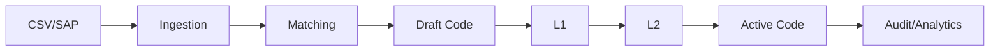

# Production Demo Flow

This demo proves the durable local workflow from a clean database to an approved Common National Material Code. It uses SQLite, mock SAP OData data, stub embeddings by default, Alembic migrations, durable users/roles, and authenticated FastAPI routes.

## Prerequisites

- Backend virtual environment created at `backend/.venv`.
- Backend dependencies installed.
- Run commands from the repository root: `C:\Users\Asus\OneDrive\Documents\ChatGPT\sih_harsh`.
- Use a dedicated demo SQLite file. The `--fresh` option is intentionally restricted to safe SQLite file locations.

## Safe Command

```powershell
.\backend\.venv\Scripts\python.exe -m pip install -r .\backend\requirements.txt
.\backend\.venv\Scripts\python.exe .\backend\run_production_demo.py --database-url "sqlite:///backend/data/production_demo.db" --fresh
```

The script prints the exact SQLite file it will recreate before deleting anything. It refuses `--fresh` for PostgreSQL/Supabase URLs, directories, root paths, and SQLite files outside `backend/data` or explicitly named demo/temp directories.

## Workflow



## Roles Used

- `ADMIN`: local administrative demo account.
- `CPSE_USER`: ingests CSV, imports SAP mock materials, runs matching, drafts the national material, and opens the approval case.
- `L1_REVIEWER`: approves the L1 workflow stage.
- `L2_AUTHORITY`: approves the L2 workflow stage and publishes the national material as `ACTIVE`.
- `AUDITOR`: verifies the durable audit hash chain.

## Expected Final State

The final JSON summary should show:

- sanitized database URL
- CSV and SAP ingestion batch IDs
- SAP import run ID
- selected match candidate ID, classification, and scores
- one National Material Code with status `ACTIVE`
- two approved source mappings
- approval case status `APPROVED`
- audit chain status `CHAIN_INTACT`
- non-zero production analytics headline counts
- a note that SAP is mock mode and embeddings are stub unless configured otherwise

## Production-Backed Versus Demo-Only Routes

Production-backed routes exercised by this demo include durable CSV ingestion, SAP mock import, persistent matching, national material draft creation, persistent approval cases, persistent audit verification, and analytics summary.

Demo-only routes remain intentionally available for SIH walkthrough compatibility, including the in-memory demo summary, approval queue/action simulation, demo audit trail, placeholder material catalog endpoints, and sample matching/explainability endpoints.

## Known Limitations

- Basic Auth only; no SSO/OAuth/SAML/MFA.
- SAP test path uses mock mode by default.
- Real embeddings are optional and configuration-gated.
- Vectors are stored as JSON, not pgvector.
- No production deployment, secret vault, SSO, certified live SAP connectivity, background job queue, or large-scale production tuning yet.
